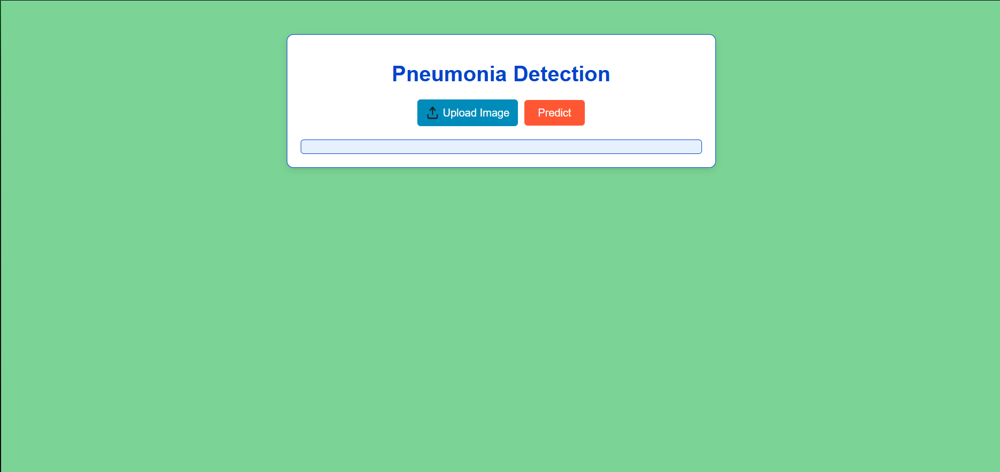
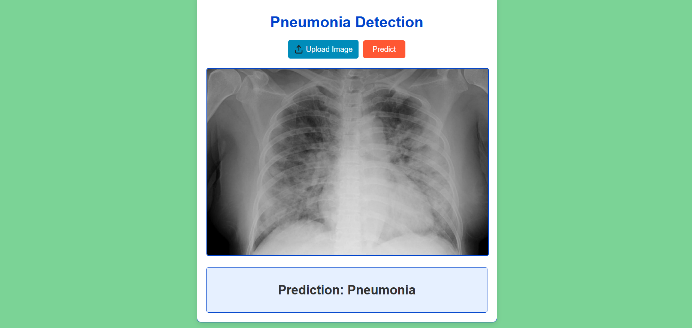
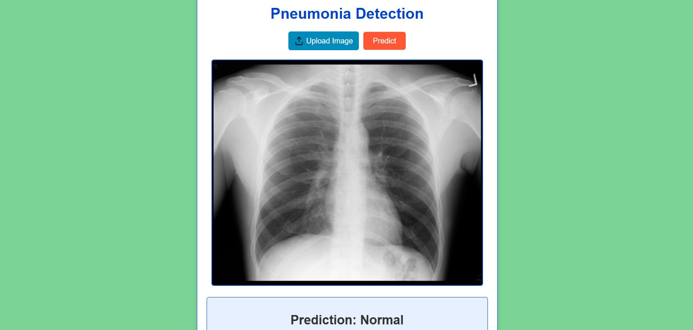

# 🩺 Pneumonia Classifier

A web app that uses deep learning to detect pneumonia from chest X-ray images.  
Upload an image and get an instant prediction of **Normal** or **Pneumonia** using a trained neural network.

---

## 🚀 Features
- 📤 **Upload X-ray images**
- 🤖 **AI-powered pneumonia detection**
- ⚡ **Instant results**
- 🖥️ **User-friendly web interface**
- 🔒 **Secure image handling**

---

## 🖼️ Demo Screenshots





---

## 🛠️ Technologies Used
- 🐍 Python (Flask)
- 🧠 TensorFlow/Keras
- 🌐 HTML, CSS, JavaScript

---

## 📝 Installation

1. **Clone the repository:**  
   ```bash
   git clone https://github.com/vickii20/Pneumonia-Classifier.git
   ```
2. **Install dependencies:**  
   ```bash
   pip install -r requirements.txt
   ```
3. **Start the server:**  
   ```bash
   python app.py
   ```
4. **Open in your browser:**  
   [http://localhost:5000](http://localhost:5000)

---

## 📂 Dataset
Uses the [Chest X-Ray Images (Pneumonia) dataset](https://www.kaggle.com/datasets/paultimothymooney/chest-xray-pneumonia) from Kaggle.

---

## 📄 License
MIT License © 2025 Vignesh R.

--- 