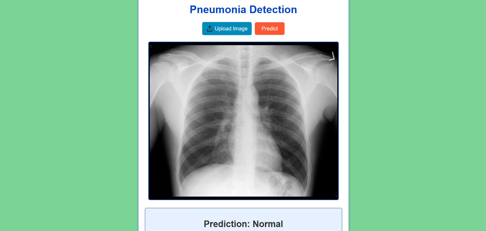

# 🩺 Pneumonia Detection Website 🖼️

---

Welcome to the Pneumonia Detection Website! This project is a web-based application designed to detect pneumonia in chest X-ray images using a deep learning model. The application provides an easy-to-use interface for uploading images and receiving diagnostic predictions.

## 🚀 Features
- 📤 **Image Upload:** Upload chest X-ray images for analysis.
- 🤖 **Pneumonia Detection:** Uses a trained deep learning model (TensorFlow/Keras) to classify X-rays as 'Normal' or 'Pneumonia'.
- 🖥️ **User-Friendly Interface:** Intuitive and responsive design for seamless interaction.
- 🔒 **Secure:** Uploaded images are handled securely and not stored permanently.

## 🖼️ Demo Screenshot


## Technologies Used
- **Frontend:** HTML, CSS, JavaScript
- **Backend:** Python (Flask)
- **Machine Learning:** TensorFlow/Keras

## Installation

1. **Clone the repository:**
   ```bash
   git clone <your-repo-url>
   ```
2. **Navigate to the project directory:**
   ```bash
   cd Pneumonia_Detection_Website-main
   ```
3. **Install dependencies:**
   The project includes a `requirements.txt` file listing all necessary dependencies. Install them with:
   ```bash
   pip install -r requirements.txt
   ```
4. **Start the server:**
   ```bash
   python app.py
   ```
5. **Open the website in your browser:**
   [http://localhost:5000](http://localhost:5000)

## Usage
1. Upload a chest X-ray image using the provided form.
2. Click "Predict" to process the image.
3. View the diagnostic result on the page.

## Dataset
This project uses the [Chest X-Ray Images (Pneumonia) dataset](https://www.kaggle.com/datasets/paultimothymooney/chest-xray-pneumonia) from Kaggle. Ensure you have permission to use the dataset as per its license.

## Contributing
We welcome contributions to improve this project!

1. Fork the repository.
2. Create a new branch for your feature or bug fix:
   ```bash
   git checkout -b feature-name
   ```
3. Commit your changes and push to your branch:
   ```bash
   git push origin feature-name
   ```
4. Submit a pull request.

## License

This project is licensed under the MIT License. Copyright (c) 2025 Vignesh R.

You are free to use, modify, and distribute this code with proper attribution.

## Acknowledgments
- The dataset providers
- Open-source libraries and frameworks used in the project
